# Feedback Loops

This document visualizes the feedback processes that allow the workflow to adapt based on learnings. For detailed processes, see [FeedbackLoops.md](FeedbackLoops.md) and [RFC.md](RFC.md). For main workflow, see [workflow-overview.md](workflow-overview.md).

## Overview

The workflow has two feedback mechanisms:

1. **RFC (Request for Change)** - Tactical feedback for amending artifacts during implementation
2. **Checkpoint Review** - Strategic feedback for updating planning documents between phases

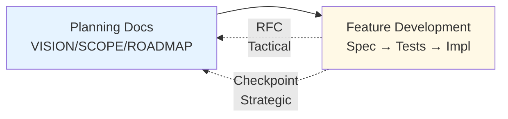

---

## RFC (Request for Change) - Tactical Feedback

### Purpose

RFCs handle **tactical issues discovered during implementation**:
- Spec missing details needed for skeleton
- Test writer finds missing acceptance criteria
- Implementer finds conflicting requirements
- Implementation reveals spec impractical

### When to Use

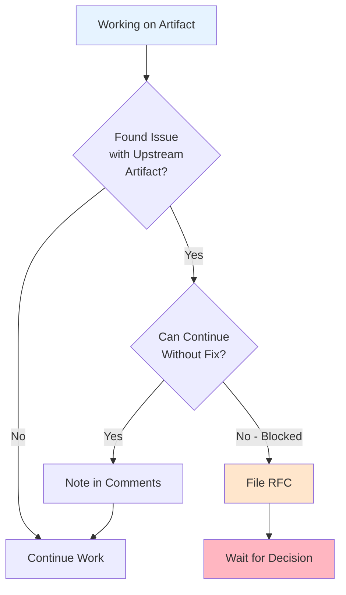

### RFC Process Flow

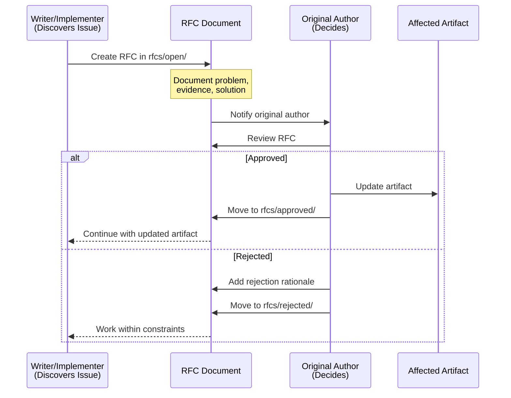

### RFC Lifecycle

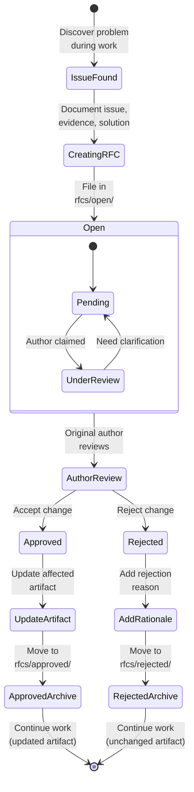

### RFC Scenarios

#### Scenario 1: Spec Change During Skeleton Writing

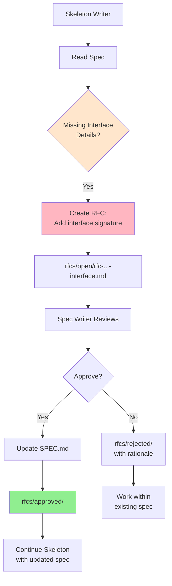

#### Scenario 2: Test Change Request (Extra Scrutiny)

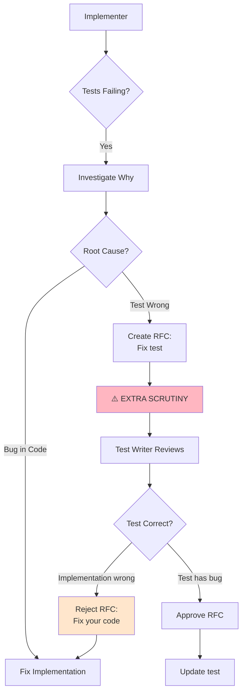

**Why extra scrutiny for test changes?**
- Tests are the spec's executable form
- Weakening tests defeats TDD
- 90% of time, implementation is wrong, not test
- Test changes require strong justification

---

## Checkpoint Review - Strategic Feedback

### Purpose

Checkpoint Reviews handle **strategic updates to planning documents**:
- Phase completion reveals new priorities
- High RFC rate indicates planning issues
- Core assumptions invalidated (technical or market changes)
- Implementation learnings require replanning

### Triggers

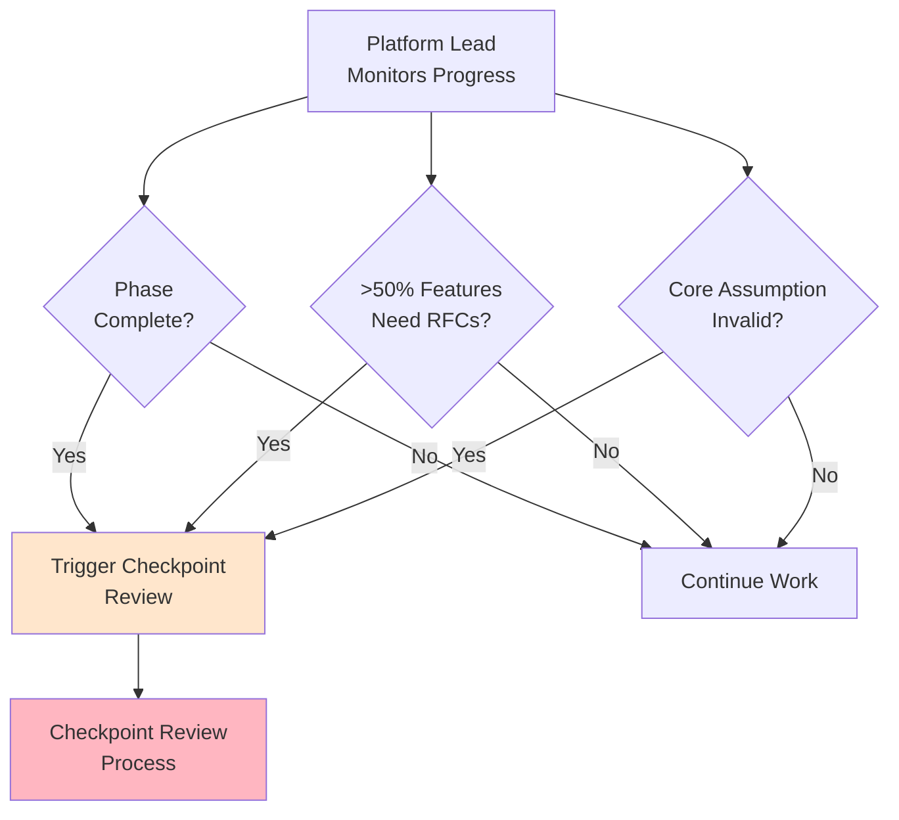

### Checkpoint Review Process

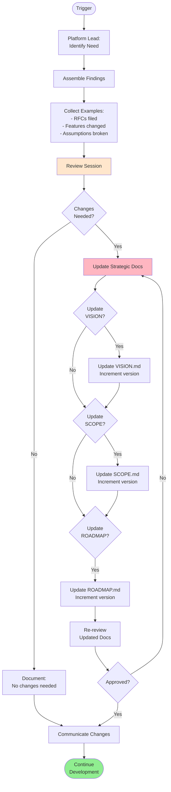

### Checkpoint Review Example

#### Trigger: High RFC Rate

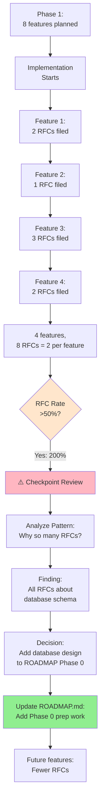

### Checkpoint Review Outcomes

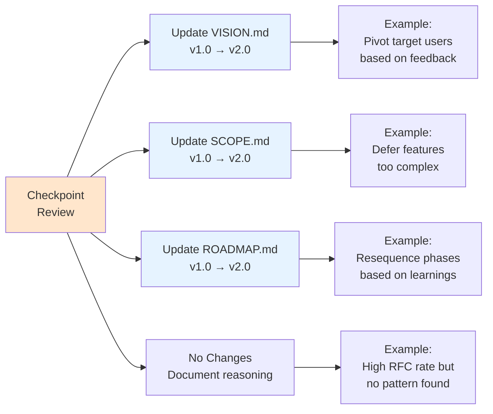

---

## Feedback Loop Integration

### Normal Flow (No Feedback)

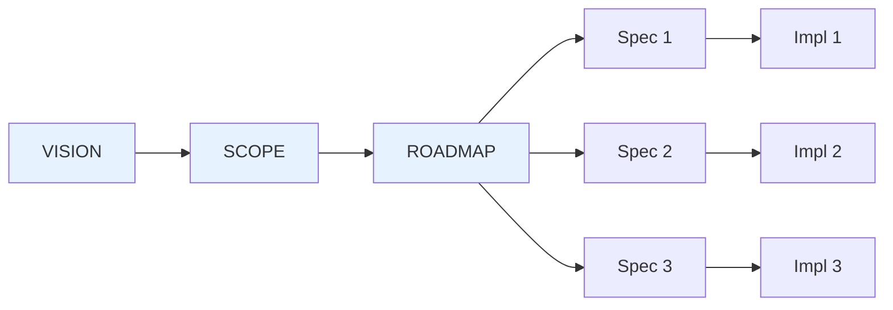

**Clean cascade:** Each stage flows to next without changes.

### With Tactical Feedback (RFCs)

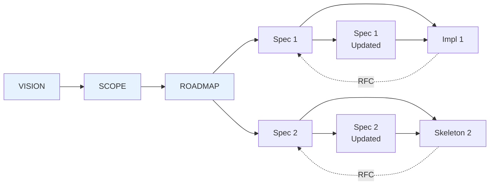

**Tactical adjustments:** Individual specs updated during implementation.

### With Strategic Feedback (Checkpoint Review)

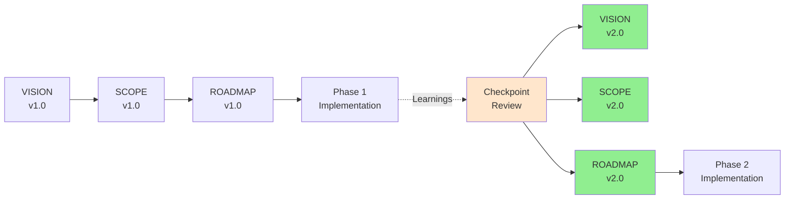

**Strategic pivots:** Planning documents updated between phases.

---

## Comparison: RFC vs Checkpoint Review

| Aspect | RFC (Tactical) | Checkpoint Review (Strategic) |
|--------|----------------|-------------------------------|
| **Scope** | Single artifact (one spec, one test) | Multiple planning documents |
| **Frequency** | As needed during implementation | Between phases or when triggered |
| **Who Triggers** | Any writer/implementer | Platform Lead |
| **Who Decides** | Original artifact author | Review session with stakeholders |
| **Changes** | Targeted updates to one artifact | Broad updates to VISION/SCOPE/ROADMAP |
| **Evidence** | Specific blocker or issue | Pattern of issues, phase completion, assumption invalidation |
| **Process** | Lightweight: File RFC → Author decides → Continue | Heavyweight: Gather findings → Session → Update → Re-review |
| **Example** | "Spec missing function signature for login()" | "Phase 1 revealed users want mobile-first, not desktop-first" |
| **Version Change** | No version change to artifact | Major version increment (v1.0 → v2.0) |

---

## When to Use Which Feedback Mechanism

### Use RFC When:

✓ Specific artifact has issue blocking current work
✓ Issue is tactical (missing detail, unclear requirement)
✓ Scope limited to one artifact
✓ Quick decision needed to unblock
✓ Original author can decide independently

**Example:** "SPEC.md doesn't define return type for validate_email() function"

### Use Checkpoint Review When:

✓ Multiple artifacts affected
✓ Pattern of issues across features (high RFC rate)
✓ Phase completed, learnings need incorporation
✓ Core assumption invalidated
✓ Strategic direction needs adjustment

**Example:** "Phase 1 revealed 80% of RFCs about database design - we need database design phase before features"

### Don't Use Feedback When:

❌ Normal clarification question (just ask)
❌ Implementation detail not in spec (implement using best judgment)
❌ Preference or style issue (follow GUIDELINES.md)
❌ Small typo or formatting (just fix it)

**Example:** "Should I use snake_case or camelCase?" → Check GUIDELINES.md, don't file RFC

---

## Anti-Patterns

### ❌ Anti-Pattern 1: RFC for Everything

**Problem:** Filing RFCs for trivial issues or normal questions

```mermaid
graph TD
    W[Writer] --> Q1[Question:<br/>Should function<br/>return None or []?]
    Q1 -.❌.-> RFC1[File RFC]
    Q1 -.✓.-> Check[Check GUIDELINES.md]

    W --> Q2[Question:<br/>SPEC unclear<br/>on error handling]
    Q2 -.✓.-> RFC2[File RFC]

    style RFC1 fill:#FFB6C1
    style RFC2 fill:#90EE90
```

**Fix:** Only file RFC when actually blocked or spec fundamentally unclear.

### ❌ Anti-Pattern 2: Checkpoint Review Without Evidence

**Problem:** Calling Checkpoint Review based on feeling, not data

```
❌ "I think we should change the roadmap because..."
✓ "4 of 5 features required RFCs changing the data model, indicating..."
```

**Fix:** Gather concrete evidence (RFC rate, phase completion data, specific assumption invalidations).

### ❌ Anti-Pattern 3: Updating Docs Without Review

**Problem:** Changing planning docs directly without formal review

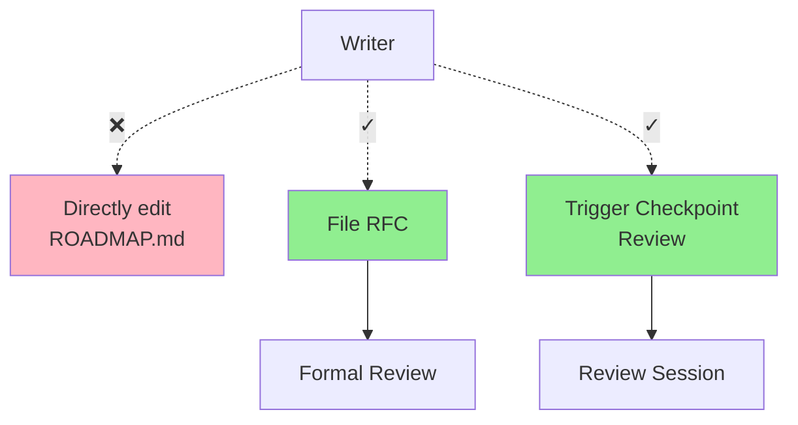

**Fix:** Always use formal process (RFC or Checkpoint Review) for planning document changes.

---

## Navigation

- **[FeedbackLoops.md](FeedbackLoops.md)** - Detailed Checkpoint Review process
- **[RFC.md](RFC.md)** - Detailed RFC process with templates
- **[Workflow Overview](workflow-overview.md)** - Main workflow diagrams
- **[State Transitions](state-transitions.md)** - Directory movements and ownership
