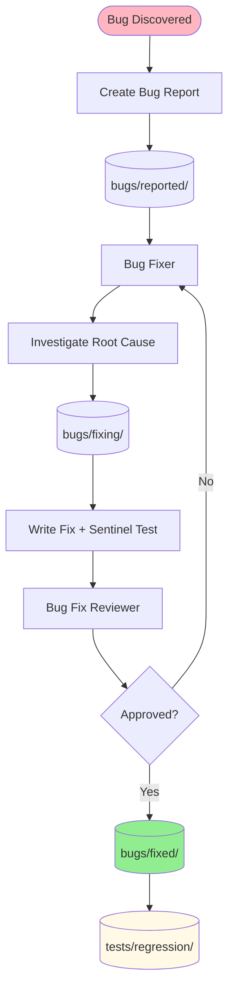
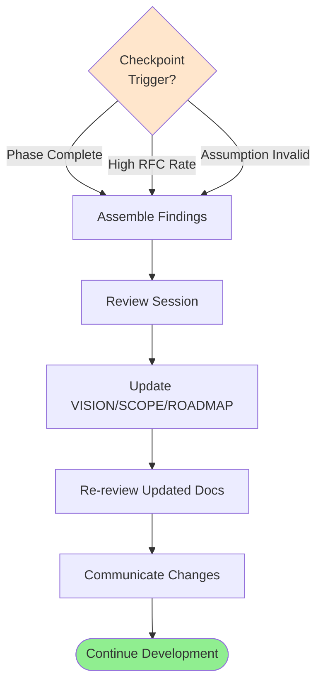
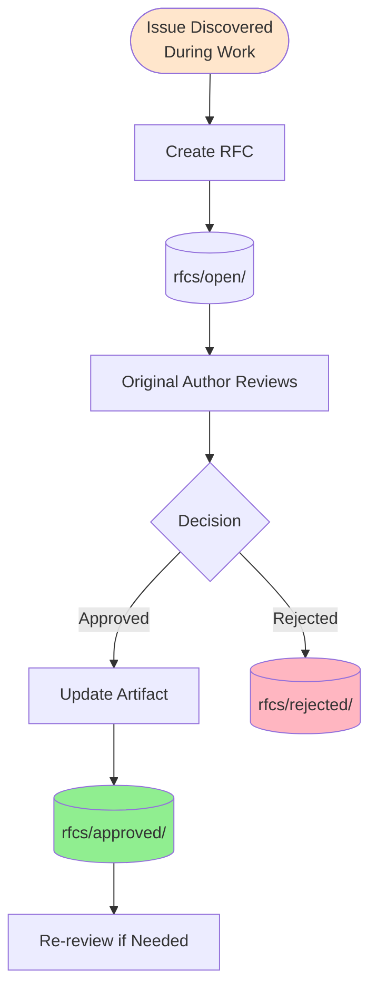

# Workflow Overview

This document provides a high-level overview of the development workflow. For detailed state transitions, see [state-transitions.md](state-transitions.md). For feedback processes, see [feedback-loops-diagram.md](feedback-loops-diagram.md). For a comprehensive visual reference, see [workflow-diagram.svg](workflow-diagram.svg).

## Main Workflow Path

The workflow follows a cascading pattern from high-level vision to concrete implementation:

```mermaid
graph TD
    Start([Start New Project]) --> VisionDiscussion[Vision Discussion]
    VisionDiscussion --> VisionWriter[Vision Writer]
    VisionWriter --> VisionDoc[(VISION.md)]
    VisionDoc --> VisionReviewer[Vision Reviewer]
    VisionReviewer --> VisionApproved{Approved?}
    VisionApproved -->|No| VisionWriter
    VisionApproved -->|Yes| ScopeDiscussion[Scope Discussion]

    ScopeDiscussion --> ScopeWriter[Scope Writer]
    ScopeWriter --> ScopeDoc[(SCOPE.md)]
    ScopeDoc --> ScopeReviewer[Scope Reviewer]
    ScopeReviewer --> ScopeApproved{Approved?}
    ScopeApproved -->|No| ScopeWriter
    ScopeApproved -->|Yes| RoadmapDiscussion[Roadmap Discussion]

    RoadmapDiscussion --> RoadmapWriter[Roadmap Writer]
    RoadmapWriter --> RoadmapDoc[(ROADMAP.md)]
    RoadmapDoc --> RoadmapReviewer[Roadmap Reviewer]
    RoadmapReviewer --> RoadmapApproved{Approved?}
    RoadmapApproved -->|No| RoadmapWriter
    RoadmapApproved -->|Yes| FeatureLoop[For Each Feature...]

    FeatureLoop --> SpecWriter[Spec Writer]
    SpecWriter --> SpecDoc[(Feature SPEC.md)]
    SpecDoc --> SpecReviewer[Spec Reviewer]
    SpecReviewer --> SpecApproved{Approved?}
    SpecApproved -->|No| SpecWriter
    SpecApproved -->|Yes| SkeletonWriter[Skeleton Writer]

    SkeletonWriter --> SkeletonCode[(Skeleton Code)]
    SkeletonCode --> SkeletonReviewer[Skeleton Reviewer]
    SkeletonReviewer --> SkeletonApproved{Approved?}
    SkeletonApproved -->|No| SkeletonWriter
    SkeletonApproved -->|Yes| TestWriter[Test Writer]

    TestWriter --> TestCode[(Test Code)]
    TestCode --> TestReviewer[Test Reviewer]
    TestReviewer --> TestApproved{Approved?}
    TestApproved -->|No| TestWriter
    TestApproved -->|Yes| Implementer[Implementer]

    Implementer --> ImplCode[(Implementation)]
    ImplCode --> ImplReviewer[Implementation Reviewer]
    ImplReviewer --> ImplApproved{Approved?}
    ImplApproved -->|No| Implementer
    ImplApproved -->|Yes| Done([Feature Complete])

    Done --> MoreFeatures{More Features?}
    MoreFeatures -->|Yes| FeatureLoop
    MoreFeatures -->|No| ProjectComplete([Project Complete])

    style Start fill:#90EE90
    style ProjectComplete fill:#90EE90
    style VisionDoc fill:#E6F3FF
    style ScopeDoc fill:#E6F3FF
    style RoadmapDoc fill:#E6F3FF
    style SpecDoc fill:#E6F3FF
    style SkeletonCode fill:#FFF9E6
    style TestCode fill:#FFF9E6
    style ImplCode fill:#FFF9E6
```

## Key Principles

### 1. Cascading Refinement
- **Vision** defines the 2-5 year direction
- **Scope** translates vision into concrete deliverables
- **Roadmap** sequences scope into phased releases
- **Specs** detail individual features with acceptance criteria
- **Code** implements specs through TDD (skeleton → tests → implementation)

### 2. Review Gates
Every artifact passes through a review gate before proceeding:
- **Writer creates** artifact in appropriate location
- **Reviewer evaluates** against quality criteria and schemas
- **Approved artifacts advance**, rejected artifacts return to writer
- **No work starts** on next stage until current stage approved

### 3. Test-Driven Development (TDD)
The feature implementation cycle follows strict TDD:
1. **Skeleton**: Interfaces and contracts (no logic)
2. **Tests**: Comprehensive test suite (must fail initially - RED phase)
3. **Implementation**: Code that makes tests pass (GREEN phase)
4. **Review**: Verify all tests pass and spec compliance

### 4. Living Documents
- Documents evolve through feedback loops (RFC, Checkpoint Review)
- Version controlled with git
- Linked to implementation (tests reference specs, code references interfaces)
- Updated when implementation reveals planning issues

## Role Patterns

### Writer Roles
Create artifacts from requirements:
- **Vision Writer**: Creates VISION.md from product ideas
- **Scope Writer**: Creates SCOPE.md from approved vision
- **Roadmap Writer**: Creates ROADMAP.md from approved scope
- **Spec Writer**: Creates feature specs from roadmap features
- **Skeleton Writer**: Creates interface code from approved specs
- **Test Writer**: Creates tests from approved specs and skeletons
- **Implementer**: Creates implementation from failing tests

### Reviewer Roles
Gate artifacts before advancement:
- **Vision Reviewer**: Evaluates VISION.md for clarity and feasibility
- **Scope Reviewer**: Evaluates SCOPE.md for alignment and completeness
- **Roadmap Reviewer**: Evaluates ROADMAP.md for sequencing and timing
- **Spec Reviewer**: Evaluates specs for testability and clarity
- **Skeleton Reviewer**: Evaluates skeleton for contract compliance
- **Test Reviewer**: Evaluates tests for completeness and quality
- **Implementation Reviewer**: Evaluates implementation for correctness

### Helper Roles
Assist with artifact creation through conversation:
- **Vision Writing Helper**: Guides vision creation via dialogue
- **Scope Writing Helper**: Guides scope definition via dialogue
- **Roadmap Writing Helper**: Guides roadmap sequencing via dialogue
- **Spec Writing Helper**: Guides spec detailing via dialogue

## Parallel Workflows

### Bug Fix Workflow
Runs in parallel with feature development:

**Key differences from feature workflow:**
- No spec (bug report serves as spec)
- Sentinel test must fail on old code, pass on new code
- Test verifies specific bug doesn't recur
- Minimal scope (fix the bug, don't add features)

### Checkpoint Review Workflow
Strategic feedback loop for replanning:

**Triggers:**
- Phase completion (natural checkpoint)
- >50% features require spec changes (high RFC rate)
- Core assumption invalidated (technical/market change)

### RFC (Request for Change) Workflow
Tactical feedback for amending artifacts:

**When to use:**
- Skeleton writer finds spec unclear
- Test writer finds missing acceptance criteria
- Implementer finds conflicting requirements
- Any downstream role finds upstream artifact issues

## Artifact Locations

### Planning Documents
- `VISION.md` - Project vision (root)
- `SCOPE.md` - Project scope (root)
- `ROADMAP.md` - Phased roadmap (root)

### Feature Specs
- `specs/proposed/` - Draft specs
- `specs/todo/` - Approved, not started
- `specs/doing/` - Currently implementing
- `specs/done/` - Implementation complete

### Code
- `src/` - Production code
- `tests/unit/` - Unit tests (fast, isolated)
- `tests/integration/` - Integration tests (slower, real dependencies)
- `tests/regression/` - Sentinel tests (prevent bug recurrence)

### Reviews
- `reviews/vision/` - Vision reviews
- `reviews/scope/` - Scope reviews
- `reviews/roadmap/` - Roadmap reviews
- `reviews/specs/` - Spec reviews
- `reviews/skeletons/` - Skeleton reviews
- `reviews/tests/` - Test reviews
- `reviews/implementations/` - Implementation reviews
- `reviews/bug-fixes/` - Bug fix reviews

### Review Requests
- `review-requests/[type]/` - Formalized review requests with context

### Bug Reports
- `bugs/reported/` - Newly reported bugs
- `bugs/fixing/` - Under investigation/fixing
- `bugs/fixed/` - Fixed with sentinel tests

### Feedback Processes
- `rfcs/open/` - Pending change requests
- `rfcs/approved/` - Approved changes
- `rfcs/rejected/` - Rejected changes with rationale

### Reference Documents
- `Workflow/` - Schema definitions, role descriptions, guidelines
- `GUIDELINES.md` - Architecture patterns and code conventions
- `SYSTEM_MAP.md` - System architecture and organization

## Quick Reference: Who Does What

| Role | Input | Output | Next Role |
|------|-------|--------|-----------|
| Vision Writer | Product ideas | VISION.md | Vision Reviewer |
| Vision Reviewer | VISION.md | Review | Scope Writer (if approved) |
| Scope Writer | VISION.md | SCOPE.md | Scope Reviewer |
| Scope Reviewer | SCOPE.md | Review | Roadmap Writer (if approved) |
| Roadmap Writer | SCOPE.md | ROADMAP.md | Roadmap Reviewer |
| Roadmap Reviewer | ROADMAP.md | Review | Spec Writer (if approved) |
| Spec Writer | Roadmap feature | Feature SPEC.md | Spec Reviewer |
| Spec Reviewer | SPEC.md | Review | Skeleton Writer (if approved) |
| Skeleton Writer | SPEC.md | Skeleton code | Skeleton Reviewer |
| Skeleton Reviewer | Skeleton + SPEC | Review | Test Writer (if approved) |
| Test Writer | SPEC + Skeleton | Test suite | Test Reviewer |
| Test Reviewer | Tests + SPEC | Review | Implementer (if approved) |
| Implementer | Tests (failing) | Implementation | Implementation Reviewer |
| Implementation Reviewer | Impl + Tests | Review | Done (if approved) |

## Navigation

- **[State Transitions](state-transitions.md)** - Detailed directory movements and ownership
- **[Feedback Loops](feedback-loops-diagram.md)** - RFC and Checkpoint Review processes
- **[Workflow Diagram (SVG)](workflow-diagram.svg)** - Comprehensive visual reference
- **[Workflow.md](Workflow.md)** - Detailed workflow documentation
- **[LayoutAndState.md](LayoutAndState.md)** - Directory structure and state machine
